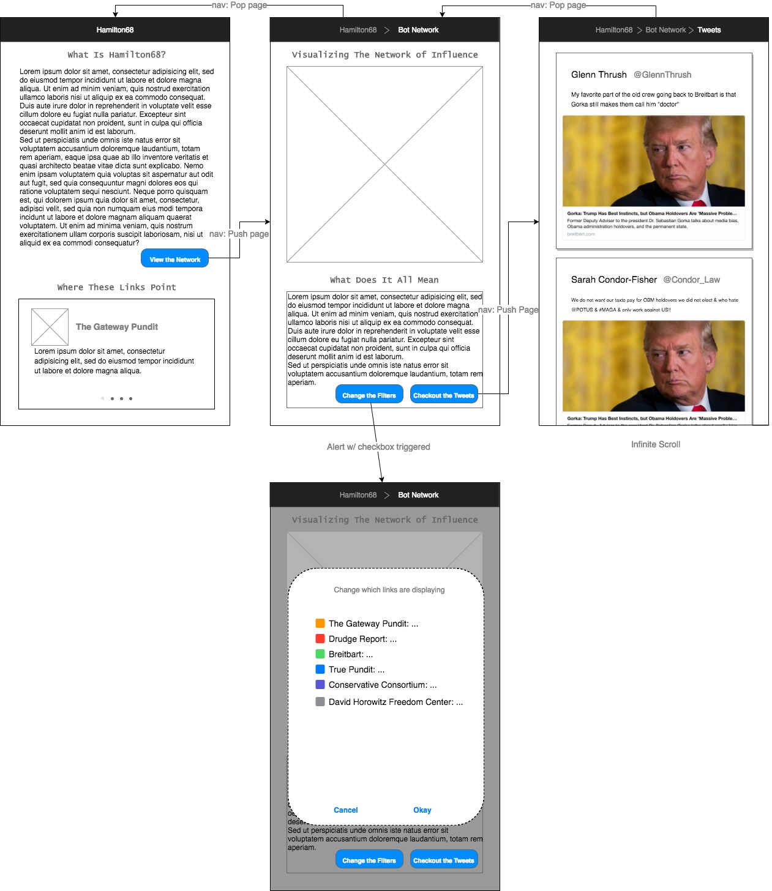

# Shill Scraper
This is a side project of mine in order to gain some familiarity with ionic apps.  

## Project Premise
The app allows the user to visualize the social graph of tweets that contain links from the [Hamilton68](http://dashboard.securingdemocracy.org/) top trending URLs. These URLs tend to be articles being pushed by known russian twitter bots. The purpose of shill_scraper is to try to visualize the social influence of the bots.

## UI Mockup

## Running the Project
Assuming you have [ionic]() installed do the following:
1. clone the repo. := `$ git clone git@github.com:thomasLevans/shill_scraper.git`
2. serve the app. := `$ cd shill_scraper && ionic serve`
3. the app will run on `localhost:8100` and should launch in a browser window automatically.

## CI and Deployment
_TBD_

### CI
_TBD_

### Deployment
_TBD_